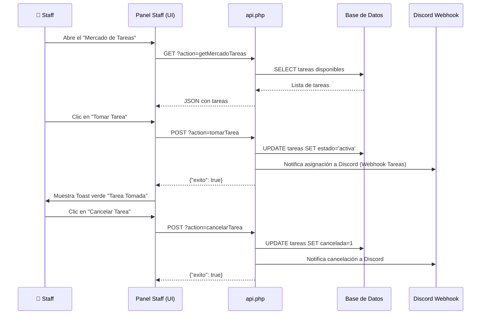

# Documentación Técnica: Crimson Scan Web

Este documento tiene como objetivo explicar la arquitectura, el flujo de datos y la organización del código del sitio web de **Crimson Scan**. Está diseñado para que cualquier programador que se una al proyecto pueda entender rápidamente cómo funciona el sistema.

---

## 1. Estructura General del Proyecto

El sistema está construido principalmente en **PHP puro** (sin frameworks pesados), utilizando **Javascript Vainilla** en el frontend para el manejo interactivo de la interfaz (estilo Single Page Application en los paneles) y **MySQL/MariaDB** para la base de datos.

```text
scancrimson/
├── database/
│   └── db.php          # Conexión a la base de datos, creación automática de tablas y funciones auxiliares (auth, logs).
├── assets/
│   ├── admin.js        # Lógica frontend interactiva del Panel de Administración.
│   ├── admin.css       # Estilos específicos del Panel Admin y Toasts.
│   ├── app.js          # Lógica frontend interactiva del Panel de Staff (Mercado de tareas).
│   └── style.css       # Estilos globales y del Panel de Staff.
├── api.php             # API Principal del frontend. Recibe peticiones AJAX/Fetch (POST/GET) de la UI y devuelve JSON.
├── bot_api.php         # API exclusiva para la comunicación con el Bot de Discord.
├── admin.php           # Interfaz HTML del Panel de Administración (Gestión de usuarios, webhooks, historial).
├── panel_staff.php     # Interfaz HTML del Panel del Staff (Mercado de Tareas, Mis Tareas).
├── index.php           # Página de inicio/login del sistema.
└── ARCHITECTURE.md     # Esta documentación.
```

---

## 2. Diagrama de Arquitectura del Sistema

Este diagrama ilustra cómo se comunican las distintas partes del ecosistema (El usuario, la página web, el bot y Discord).

```mermaid
graph TD
    %% Componentes Principales
    Usuario([👤 Staff / Admin])
    WebUI[🖥️ Frontend Web (HTML/JS)]
    API[⚙️ Backend Web (api.php)]
    DB[(🗄️ Base de Datos MySQL)]
    BotAPI[🤖 Bot API (bot_api.php)]
    BotDiscord[🎮 Bot de Discord (Python)]
    DiscordWebhook[📢 Discord Webhooks]

    %% Flujos de usuario
    Usuario -- "Usa interfaz" --> WebUI
    WebUI -- "Fetch API (AJAX)" --> API
    API -- "Lee/Escribe" --> DB
    
    %% Flujo Webhooks
    API -- "Envía Notificaciones" --> DiscordWebhook
    
    %% Flujo del Bot
    BotDiscord -- "Sincroniza datos" --> BotAPI
    BotAPI -- "Lee/Escribe" --> DB
```

---

## 3. Diagrama de Flujo: Mercado de Tareas

El ciclo de vida de una tarea (Manga, Traducción, Limpieza, etc.) involucra múltiples interacciones entre el Staff y la Base de Datos.



---

## 4. Descripción de Componentes Core

### 4.1. `database/db.php`
Es el núcleo de la aplicación. Maneja la conexión PDO a MySQL.
- **Creación dinámica:** Contiene comandos `CREATE TABLE IF NOT EXISTS` que se ejecutan automáticamente al cargar, por lo que el esquema de la base de datos se mantiene sincronizado sin necesidad de correr migraciones manuales.
- **Sesiones y Auth:** Incluye las funciones `auth_start()`, `auth_login()` y `auth_get_user()` para el manejo de inicio de sesión de los miembros del Staff.

### 4.2. `api.php`
Es el controlador que maneja TODA la lógica del sistema web interactivo a través del parámetro `?action=...`.
- Devuelve respuestas estrictamente en formato `JSON`.
- Funciones clave: `tomarTarea`, `cancelarTarea`, `solicitarExtension`, `setConfigSistema`, `crearUsuario`.
- Utiliza la API de `cURL` internamente para enviar mensajes silenciosos a los Webhooks de Discord (se hace un `trim()` de la URL por seguridad).

### 4.3. `bot_api.php`
Un Endpoint protegido diseñado para que el Bot de Discord (BotCrimson) interactúe con la base de datos de la web sin estar en el mismo servidor.
- Protegido mediante un `API_KEY`.
- El bot envía peticiones POST hacia aquí para crear nuevas tareas, marcar tareas como atrasadas, o actualizar expedientes.

### 4.4. Panel Staff (`panel_staff.php` & `app.js`)
Diseñado para los trabajadores del Scan. Las pestañas ("Mercado", "Mis Tareas", "Subir") se controlan mediante Javascript en `app.js`, ocultando y mostrando `divs` sin recargar la página.

### 4.5. Panel Admin (`admin.php` & `admin.js`)
Diseñado para los líderes. Permite configurar variables críticas del sistema que se guardan en la tabla `config_bot` (como los tokens y webhooks).

---

## 5. Tabla de Configuración (config_bot)

Las integraciones clave (Telegram y Discord) son dinámicas y se almacenan en la tabla `config_bot` (clave-valor). El código PHP extrae estos valores al vuelo para evitar 'hardcodear' configuraciones:
- `discord_webhook_subidas`: Webhook para notificar capítulos terminados/publicados.
- `discord_webhook_anuncios`: Webhook para el Mercado de Tareas (asignaciones, cancelaciones, extensiones).

> **Aviso para programadores:** Al usar cURL para notificar webhooks desde PHP, siempre debes aplicar `trim($webhookUrl)` debido a que al copiar y pegar desde Discord, los usuarios suelen incluir accidentalmente espacios en blanco finales invisibles `\n` que causan errores silenciosos de conexión.

---

*Documentación autogenerada durante el desarrollo de integraciones.*
